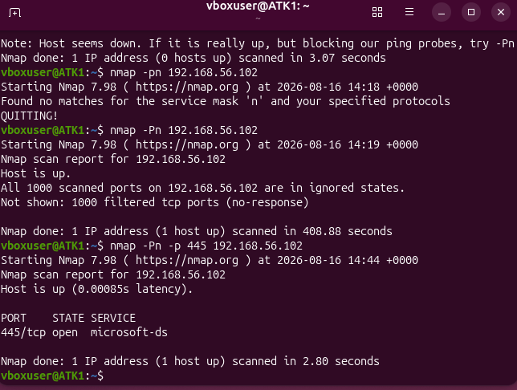
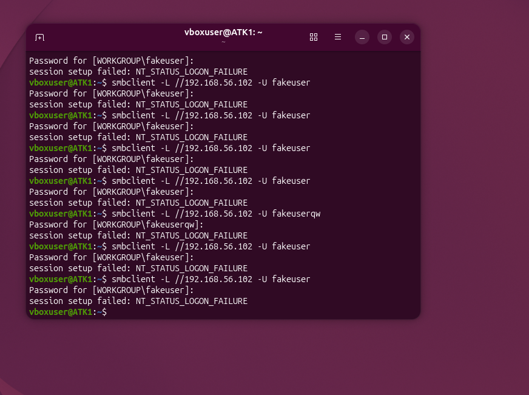
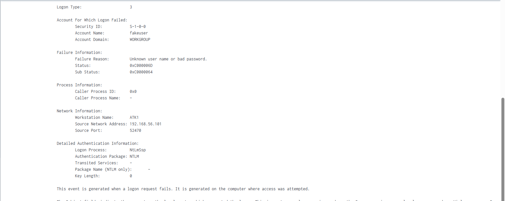
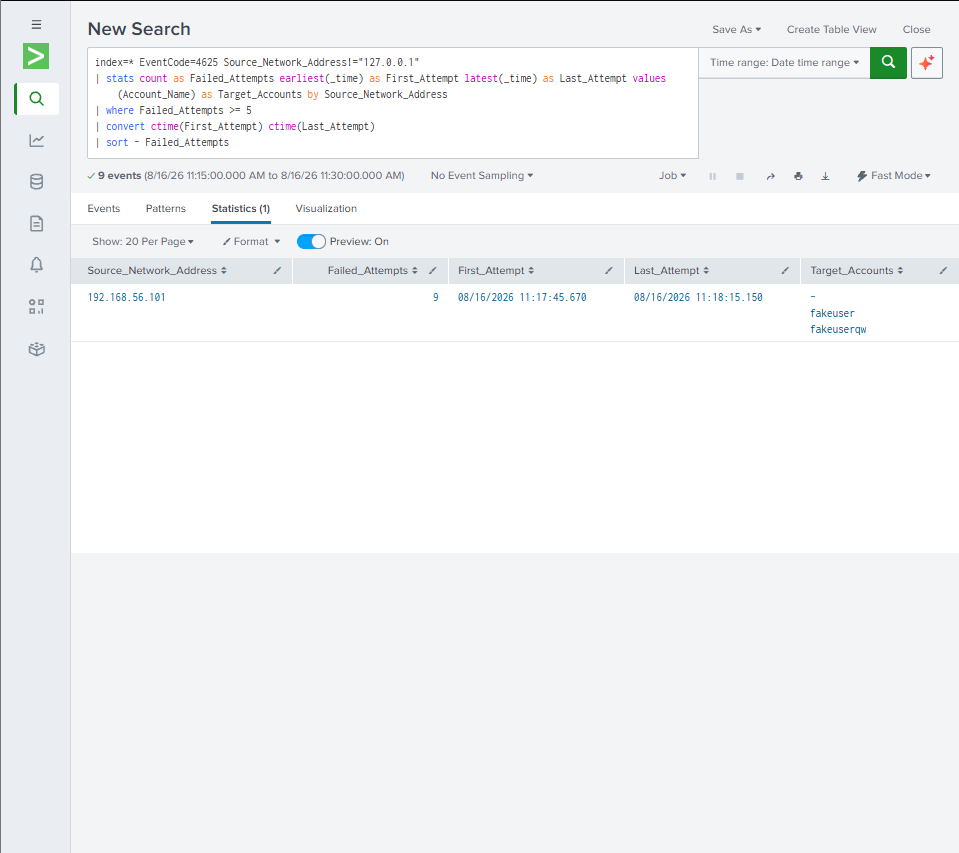
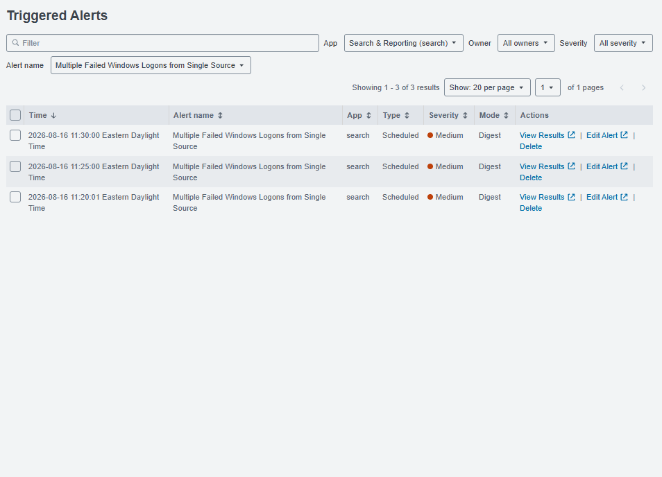

# Splunk SIEM Detection Lab

## Overview

This project documents the creation of a small security monitoring and detection lab using Splunk Enterprise, Windows, Ubuntu, and VirtualBox.

The lab was designed to simulate suspicious authentication activity against a Windows endpoint, forward Windows Security logs to a SIEM, investigate the resulting events, and create an automated Splunk detection for repeated failed logon attempts.

## Lab Objectives

- Build an isolated virtual cybersecurity lab
- Configure Windows and Ubuntu virtual machines
- Forward Windows Security Event Logs to Splunk
- Perform basic network reconnaissance from Ubuntu
- Generate controlled remote authentication failures
- Investigate Windows Event ID 4625 in Splunk
- Develop SPL detection logic for repeated failed logons
- Configure and validate an automated Splunk alert

## Technologies Used

- Splunk Enterprise
- Splunk Universal Forwarder
- Windows 10
- Ubuntu Linux
- Oracle VirtualBox
- Nmap
- SMB
- Windows Security Event Logs
- Splunk Search Processing Language (SPL)

## Lab Architecture

The environment consisted of three primary systems:

| System | Role | Lab IP |
|---|---|---|
| Ubuntu VM | Attack simulation | 192.168.56.101 |
| Windows 10 VM | Monitored endpoint | 192.168.56.102 |
| Host PC | Splunk Enterprise server | 192.168.56.1 |

A VirtualBox Host-Only network was used for communication between the lab systems while the virtual machines retained separate NAT adapters for internet connectivity.

## Detection Scenario

Nmap was used from the Ubuntu VM to perform basic reconnaissance against the Windows endpoint.

SMB TCP port 445 was intentionally exposed only to the isolated lab subnet. Controlled failed SMB authentication attempts were then generated from the Ubuntu system against the Windows VM.

The failed network logons generated Windows Security Event ID 4625 events.

Splunk Universal Forwarder collected the Windows Security logs and forwarded them to Splunk Enterprise for analysis.

## Detection Logic

The following SPL query was created to identify a remote source generating five or more failed Windows logons:

```spl
index=* EventCode=4625 Source_Network_Address!="127.0.0.1"
| stats count as Failed_Attempts earliest(_time) as First_Attempt latest(_time) as Last_Attempt values(Account_Name) as Target_Accounts by Source_Network_Address
| where Failed_Attempts >= 5
| convert ctime(First_Attempt) ctime(Last_Attempt)
| sort - Failed_Attempts
```
## Detection Evidence

### 1. SMB Service Discovery

Nmap was used from the Ubuntu attack simulation VM to identify SMB TCP port 445 as open on the Windows endpoint.



### 2. Simulated Failed Authentication

Controlled SMB authentication attempts were generated from the Ubuntu VM using invalid credentials. These attempts originated from `192.168.56.101` and targeted the Windows endpoint at `192.168.56.102`.



### 3. Windows Security Event 4625

The failed authentication attempts generated Windows Security Event ID 4625. The event records the failed account name, authentication details, and the source network address of `192.168.56.101`.



### 4. Splunk Detection Logic

Windows Security events were forwarded to Splunk using the Splunk Universal Forwarder. SPL was used to aggregate Event ID 4625 activity by source IP and identify sources generating five or more failed authentication attempts.

```spl
index=* EventCode=4625 Source_Network_Address!="127.0.0.1"
| stats count as Failed_Attempts earliest(_time) as First_Attempt latest(_time) as Last_Attempt values(Account_Name) as Target_Accounts by Source_Network_Address
| where Failed_Attempts >= 5
| convert ctime(First_Attempt) ctime(Last_Attempt)
| sort - Failed_Attempts
```

The detection identified `192.168.56.101` after nine failed authentication events and displayed the targeted accounts and activity timeframe.



### 5. Automated Alerting

The SPL detection was converted into a scheduled Splunk alert named **Multiple Failed Windows Logons from Single Source**. The alert automatically triggers when the detection returns a source exceeding the configured failed-logon threshold.



## Skills Demonstrated

- SIEM configuration and log analysis
- Splunk Search Processing Language (SPL)
- Windows Security Event analysis
- Splunk Universal Forwarder configuration
- Detection engineering
- Alert creation and tuning
- Network reconnaissance with Nmap
- SMB authentication analysis
- Linux and Windows administration
- Virtualized cybersecurity lab design
- Security event investigation

## Key Takeaway

This lab demonstrates an end-to-end detection workflow: generating controlled suspicious activity, collecting endpoint telemetry, analyzing Windows authentication events in Splunk, developing SPL detection logic, and converting that detection into an automated security alert.
